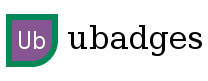
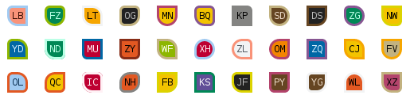

Text-only, CSS-based, name badges for websites
==============================================

**ubadges** provides CSS classes and a standard formula to generate
unique badges (ubadges) from names (usually people's names).

Instead of using pictures or avatars as image files, ubadges are text
only, meaning they are fast to generate and simple to use. Size
adjustments can be done by pure CSS, so you our your users can zoom
ubadges in/out with no loss of quality.

You can use ubadges anywhere you need to distinguish people visually by
associating a badge to them, when all you have is people's name (and,
perhaps, other uniquely identifiable data).

The default implementation can generate 26+ million unique ubadges
from name initials that use the standard English alphabet. All from a
single <5KB CSS file.




How does it work?
=================

ubadges are constructed by hashing the normalized name and (optional)
unique data. Individual values are extracted from the resulting hash
to determine the value for 3 separate badge characteristics (a.k.a
*dimensions*).

Standard ubadges use 22 background colours, 81 border radius
variations, and 22 border colours as its default 3 dimensions,
respectively. Two-letters initials are displayed inside of the badge,
so the number of visually unique standard ubadges is

    22 × 81 × 22 × 26 × 26 = 26,501,904

This number will grow larger if you use other non A-Z characters
(such as kanji or accented characters).


How to use
==========

Add `ubadge.min.css` to your web application:

    <link href="ubadges.all.css" rel="stylesheet">

Add ubadges to your HTML pages (see below).


Generating ubadges
==================

Follow the algorithm below to generate ubadges:

1. Normalize the name:

	1. Convert all letters to lowercase

	2. Trim spaces at the beginning and at the end

	3. Replace multiple space between words with 1 space character

	4. If you want to associate extra unique data to the ubadge,
       append a new line character (0x0A, "\n") character followed by the extra
       data.

3. Hash the resulting string using MD5

4. Get dimension values:

   1. First byte value of the hash modulo 22 is value 1

   2. Second byte value of the hash modulo 81 is value 2

   3. Third byte value of the hash modulo 22 is value 3

4. Get display initials - no standard formula to derive initials from
   names is specified. If you already have separate first and last
   name fields in your application, you can just use the first and
   last letter of each field, respectively. If you only store full
   names, a commonly used algorithm is to split the name into words,
   and use the first and last ones. In any case, initials **should**
   be in upper case inside the ubadge. If your application does not
   store people's full names, but identify people using single words
   (e.g usernames), or if your are processing a record with only the
   first name, use the first letter in upper case, and the second
   letter in lower case. If all you have is a single letter, use the
   letter followed by a space character. Notice that display initials
   contributes to make the ubadge visually unique, but they are
   **not** taken into account during dimension value calculations,
   thus they do not determine the CSS classes to be used.

5. Use the initials and ubadge dimension classes in your HTML. Each
   class is named as `ub_D-V`, where `D` is the dimension, and `V` is
   the value. For example, for dimensions *(4, 20, 7)* the classes are
   `ub_1-4`, `ub_2-20`, and `ub_3-7`. The resulting HTML is:

        <span class="ub ub_1-4 ub_2-20 ub_3-7">JS</span>


Example
=======

1. Input full name is "  FLÁVIO veloso  Soares"

2. Normalized name is "flávio veloso soares"

3. MD5("flávio veloso soares") = f891de369a9a38ccbf7546c119e6f335

4. Get the dimensions:

        1st byte is 0xf8 (decimal 248) mod 22 = 6  // Dimension 1
        2nd byte is 0x91 (decimal 145) mod 81 = 64 // Dimension 2
        3rd byte is 0xde (decimal 222) mod 22 = 2  // Dimension 3

5. Get the initials: "FS"

6. Output the HTML:

        <span class="ub ub_1-6 ub_2-64 ub_3-2">FS</span>


Skipping a dimension
====================

You can skip a dimension if you do not want the effects it
provides. For example, to make all ubadges round (but still have
distinguishable background colours and borders), you can simply omit
the CSS class for the second (border) dimension:

        <span class="ubadge ub_1-6 ub_3-14">FS</span>

Just keep in mind that by skipping a dimension you will be reducing
the number of unique ubadges. If you skip the second dimension, for
example, the number of unique ubadges is 327,184.


Customizing ubadges
===================

Customization can be done by simple overriding CSS classes. See the
sections below for the most common customization.

Badge size
----------

**ubadges** uses relative sizing of inner ubadges elements, based on
parent element font size. That means that you can control ubadge sizes
by just overriding the `font-size` attribute in the `.ub` class:

```css
/* Change ubadge size to 75% of default root font size. */
.ub {
    font-size: 0.75rem;
}
```

Font family
-----------

Changing ubadges font entails overriding the CSS `font-family`
attribute:

```css
.ub {
	font-family: Courier;
}
```

Note: **ubadges** uses the default monospaced from the browser by
default, so that all badges have the same width. If you want to use
variable width fonts, you may want to force a width as well, to
prevent ubadges from having different sizes:

```css
.ub {
	font-family: serif;
	width: 2.7em;
	text-align: center;
}
```

This will most likely generate rectangular ubadges. To get perfectly
squared ubadges, specify the height as well:

```css
.ub {
	font-family: serif;
	width: 2.7em;
	height: 2.7em;
	padding: 0;
	line-height: 2.2em;
	text-align: center;
}
```

Notice the use of `line-height` to make sure ubadges align
vertically. You might need to adjust those values, depending on the
font size and family used.


More customization
==================

**ubadges** uses SASS, and by customizing a few SASS variables you can
extend the framework to suit your application:

```scss
$border-width: 0.1em;

@import "/path/to/ubadges/scss/ubadges";
```


Colour palette
--------------

By default, ubadges uses the Kelly-22 colour palette to generate
distinctive colours for ubadges backgrounds (dimension 1) and border
colour (dimension 3). By changing the `$colours` variable it is
possible to define new colours and/or change the number of possible
unique ubadges.

**Important**: the number of colours in the `$colours` variable
determine the size of dimensions 1 and 3 for ubadge calculation. In
other words, if you change the number of colours you will need to use
the same number in dimensions 1 and 3 modulo calculations, instead of
*22*.


Border radius
-------------

The `$border-radiuses` variable control the variation of ubadge border
radiuses. By default it contains 3 values, which roughly map to
"square border", "slightly rounded border", and "rounded
border". These variations are combined to generate ubadge classes for
dimension 2. You may want to change the values if you want to use
different border radius.

Notice that you can *add* (or *remove*) radius variations (for
example, 4 radiuses, instead of the default 3). Just remember to
adjust your modulo calculations for dimension 2 (i.e. instead of *81*,
use *N<sup>4</sup>*, where *N* is the number of radius values used.


Other SASS customization
------------------------

See `scss/_variables.scss` for a list of variables that can be
customized.


Implementations
===============

Adding ubadges to HTML pages manually can be tiresome and
error-prone. Currently, a PHP implementation to facilitate the
generation of ubadges is available at
https://github.com/flaviovs/ubadges-php.


Bugs? Questions? Suggestions?
=============================

Please visit https://github.com/flaviovs/ubadges
